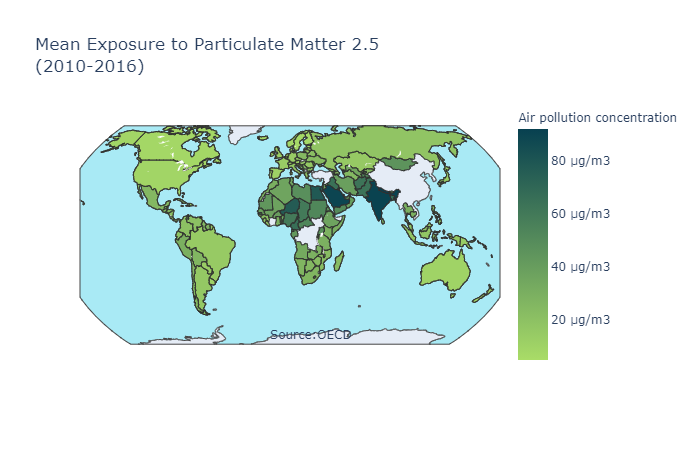
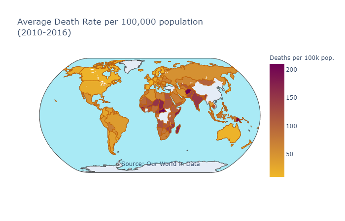
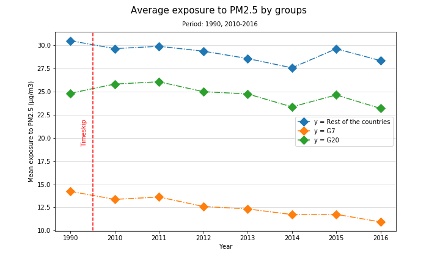

# Kyoto - World Performance Analysis

Project performed to represent the levels of exposure to particulate matter 2.5 in countries belonging to the G7, G20, as well as the rest of the countries using different representative graphs. 
For example: the next map shows the average exposure to particulate matter 2.5 (PM2.5) from 2010 to 2016. This map indicates the countries that are the most exposed to this particle. As we can observe, the countries most affected are India, Saudi Arabia, and some African nations as Niger, Egypt, and Chad.

In addition, we can see in a different map, the average death rate:

Also, scatter plots was created to demonstrate the exposition to PM2.5 in different countries belonging to G7, G20, as well as the rest of the countries 

